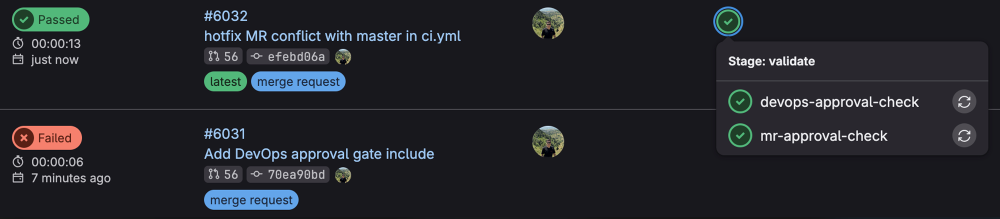
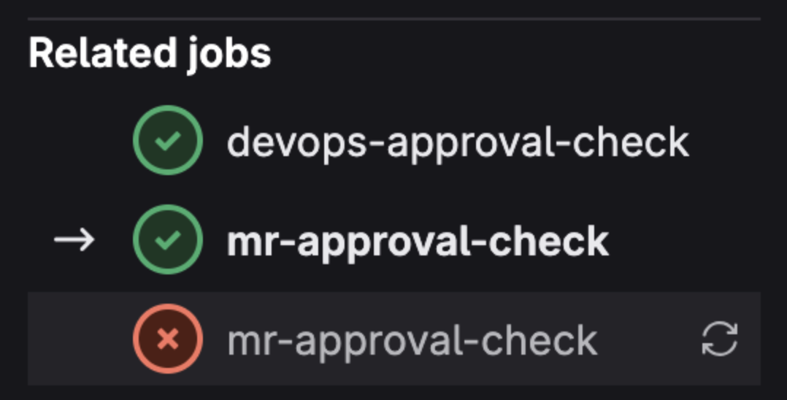
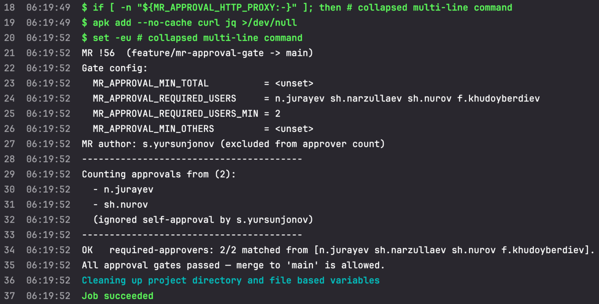
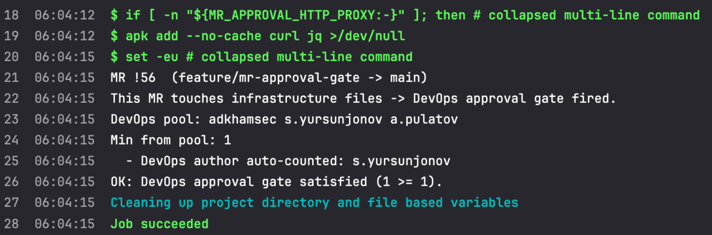
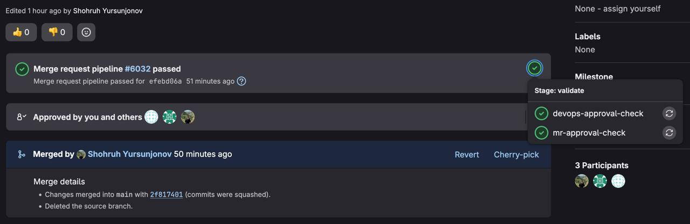
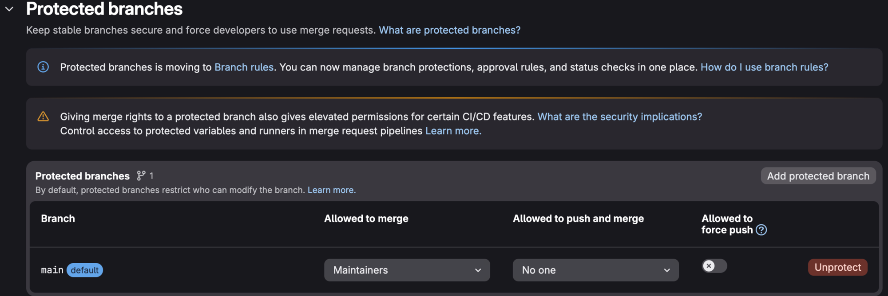
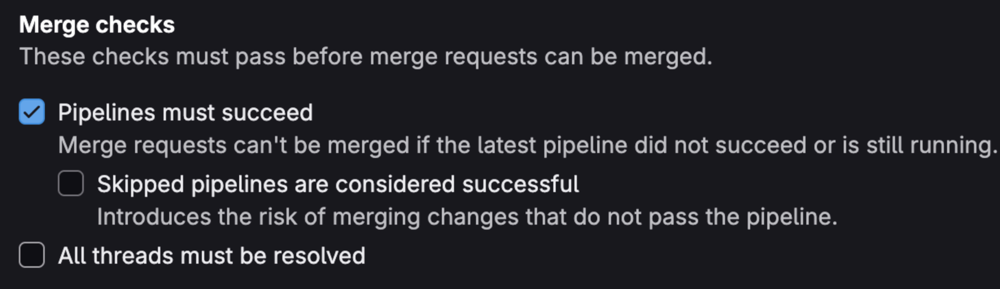
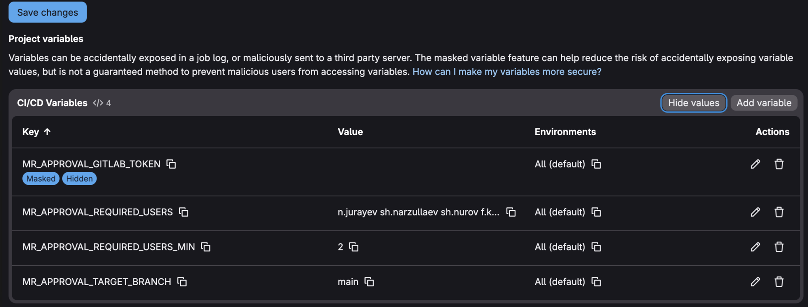

# gitlab-ce-approval-gate

**🇬🇧 English** | [🇺🇿 O'zbekcha](README.uz.md)

**Hard-enforced Merge Request approvals on GitLab CE.** Two small CI templates
that fail the pipeline when an MR doesn't have the right approvals, combined
with GitLab's "Pipelines must succeed" branch protection to actually block
the merge button.

GitLab's native approval rules are a [Premium/EE-only feature](https://docs.gitlab.com/ee/user/project/merge_requests/approvals/).
On GitLab CE you can configure approval rules in the UI but they aren't
enforced — anyone with permission can merge regardless. This repo gives you
real enforcement on CE without an EE license.

## What you get

- **`team-gate.yml`** — enforces team approval rules on MRs to your protected
  branch. Configurable: minimum total approvers, a named approver list with
  N-of-M, and a "must have N approvers outside the named list" gate. Author
  is always excluded.
- **`infra-gate.yml`** — enforces approval from an infra-owner pool *only when*
  the MR touches infrastructure files (Dockerfile, `.gitlab-ci.yml`,
  `entrypoint.sh`, `helm/`). Pure code MRs feel no friction. Author counts
  if they're an infra-owner (their authorship carries their approval).

Both compose — include both in the same pipeline and both run as separate
jobs; both must pass to allow merge.

## How it looks in practice

Real screenshots from a project running both gates against MRs targeting
`main`. The usernames you see are just what was configured for that
project — yours will be your own team. Nothing in the templates is
project-specific.

### Pipeline blocked when approvals aren't there



The lower MR was opened without the required approvals — its
`mr-approval-check` job failed and GitLab refuses to enable the Merge
button. Once the missing approvers click Approve and the pipeline re-runs
(top row), both gates pass.

### Both gates run as independent jobs



`mr-approval-check` (team approval) always runs on MRs to the protected
branch. `devops-approval-check` only fires when the MR diff touches infra
files. Both must pass; either can be retried independently.

### Team-approval gate output



The job prints the configured rules, lists who approved, **excludes the
MR author from the count** (even if they clicked Approve themselves), and
reports each gate's status (`OK` / `FAIL`). The pipeline only turns green
when every configured rule is satisfied.

### Infra-approval gate output



When the MR touches infra files, the second job fires. Note the
`DevOps author auto-counted: …` line — when the MR author is themselves
a member of the infra pool, their authorship counts as 1 toward the
minimum. A solo infra owner editing a Dockerfile doesn't need a second
click to ship.

### Merge unblocked once both gates pass



With "Pipelines must succeed" enabled (see setup below), the Merge button
only becomes available after every applicable gate is green. After
merging, the MR retains the full provenance — who approved, which
pipelines verified, and the squash/merge details.

### Required GitLab settings

Three settings on each project make the gate actually block merges:

**1. Protect the target branch** — Settings → Repository → Protected
branches. Allow merge only via MR; nobody can push directly.



**2. "Pipelines must succeed"** — Settings → Merge requests. This is the
piece that actually links the gate job's exit code to the Merge button.



**3. CI/CD variables** — Settings → CI/CD → Variables. The token plus the
per-project rules. **Important:** all four must have "Protect variable"
**unchecked**, because MR pipelines run on the (unprotected) source branch
and can't see Protected variables.



## Quick start

### 1. Include the template(s) in your project's `.gitlab-ci.yml`

```yaml
include:
  - remote: 'https://raw.githubusercontent.com/anyopsorg/gitlab-ce-approval-gate/main/team-gate.yml'

stages:
  - validate
```

If you prefer to mirror this repo into your own GitLab instance:

```yaml
include:
  - project: 'your-group/gitlab-ce-approval-gate'
    ref: main
    file: '/team-gate.yml'
```

### 2. Create a project access token

Project Settings → Access tokens → Add new token:
- Name: `mr-approval-gate`
- Role: **Reporter** (minimum that can read MR approvals)
- Scopes: **`read_api`** (read-only is enough)
- Expiration: pick a date you'll remember to rotate

### 3. Add it as a CI/CD variable

Project Settings → CI/CD → Variables → Add:

| Field | Value |
|---|---|
| Key | `MR_APPROVAL_GITLAB_TOKEN` |
| Value | the `glpat-…` token you just created |
| **Protect variable** | ☐ **unchecked** (critical — see below) |
| Mask variable | ☑ checked |

> **Why "Protected" must be off:** MR pipelines run on the source (feature)
> branch, which isn't a protected branch. Protected CI/CD variables are
> only exposed to pipelines running on protected branches — so a Protected
> token would be invisible to the gate job, and it would silently fail.

### 4. Configure the gate

Add the variables you need (Project Settings → CI/CD → Variables, all with
"Protect variable" unchecked):

```
MR_APPROVAL_TARGET_BRANCH        main
MR_APPROVAL_MIN_TOTAL            2
```

That's it — every MR to `main` will now require at least 2 distinct approvers
other than the author.

### 5. Lock the branch

To actually block merges:

- Project Settings → **Repository → Protected branches** → for your target:
  - Allowed to merge: Maintainers (or whatever your policy is)
  - Allowed to push: No one
- Project Settings → **Merge requests**:
  - ☑ **Pipelines must succeed**
  - ☑ All discussions must be resolved before a merge request can be merged

## Configuration reference

### `team-gate.yml`

| Variable | Default | Purpose |
|---|---|---|
| `MR_APPROVAL_GITLAB_TOKEN` | — | **Required.** `read_api`-scoped token, Masked, not Protected. |
| `MR_APPROVAL_TARGET_BRANCH` | `main` | Single branch this gate guards (equality match). Used when `MR_APPROVAL_TARGET_PATTERN` is empty. |
| `MR_APPROVAL_TARGET_PATTERN` | (empty) | Regex literal (including slashes) for multi-branch enforcement — e.g. `/^(staging\|main\|master)$/`. When set, overrides `MR_APPROVAL_TARGET_BRANCH`. |
| `MR_APPROVAL_MIN_TOTAL` | (unset) | Min distinct approvers, any role. Empty = gate skipped. |
| `MR_APPROVAL_REQUIRED_USERS` | (unset) | Space-separated usernames in a "required" pool. Empty = gate skipped. |
| `MR_APPROVAL_REQUIRED_USERS_MIN` | all of pool | How many from the pool must approve. |
| `MR_APPROVAL_MIN_OTHERS` | (unset) | Min approvers *outside* the required pool. Empty = gate skipped. |
| `MR_APPROVAL_IMAGE` | `alpine:3.20` | Container image (must have/install `curl` + `jq`). |
| `MR_APPROVAL_HTTP_PROXY` | (empty) | Outbound proxy URL — see [Behind a corporate proxy](#behind-a-corporate-proxy). |
| `MR_APPROVAL_NO_PROXY` | (empty) | No-proxy list for the same. |

Each gate is independently optional. Setting *none* of them makes the gate
a no-op (passes trivially).

### `infra-gate.yml`

| Variable | Default | Purpose |
|---|---|---|
| `MR_APPROVAL_GITLAB_TOKEN` | — | **Required.** Same token as `team-gate.yml`. |
| `MR_APPROVAL_INFRA_USERS` | (empty) | Space-separated infra-owner usernames. Empty = gate is a no-op. |
| `MR_APPROVAL_INFRA_MIN` | `1` | Min approvers from the pool. |
| `MR_APPROVAL_INFRA_TARGET_PATTERN` | `/^(staging\|main\|master)$/` | Regex literal of target branches that trigger. |
| `MR_APPROVAL_IMAGE` | `alpine:3.20` | Container image. |
| `MR_APPROVAL_HTTP_PROXY` | (empty) | See [Behind a corporate proxy](#behind-a-corporate-proxy). |
| `MR_APPROVAL_NO_PROXY` | (empty) | Same. |

The infra gate fires only when the MR's diff includes any of:
- `Dockerfile`, `Dockerfile.*` (root and subdirs)
- `.gitlab-ci.yml` (root only)
- `entrypoint.sh` (root and subdirs)
- `helm/**` (root-level helm directory, recursive)

The file list is hardcoded in `rules:changes:` because GitLab doesn't accept
variable lists there. If you need different paths, fork `infra-gate.yml`
and edit the list at the bottom.

## Recipes

### Backend service — 2 approvals, anyone qualifies

```
MR_APPROVAL_MIN_TOTAL=2
```

### Same rule on both staging and master

```
MR_APPROVAL_TARGET_PATTERN=/^(staging|master)$/
MR_APPROVAL_MIN_TOTAL=2
```

Use this when staging is its own quality gate (e.g. backends merging
`feature → staging` for QA, then `staging → master` for prod), and you
want peer review enforced at both steps.

### Mobile team — both leads must approve, plus 1 other dev

```
MR_APPROVAL_REQUIRED_USERS="lead-1 lead-2"
MR_APPROVAL_REQUIRED_USERS_MIN=2
MR_APPROVAL_MIN_OTHERS=1
```

### Compliance-critical repo — 1 of 3 security reviewers + 2 others

```
MR_APPROVAL_REQUIRED_USERS="sec-alice sec-bob sec-carol"
MR_APPROVAL_REQUIRED_USERS_MIN=1
MR_APPROVAL_MIN_OTHERS=2
```

### Infra-gated repo — only Dockerfile/CI/helm changes need infra approval

```
MR_APPROVAL_INFRA_USERS="infra-lead-1 infra-lead-2"
MR_APPROVAL_INFRA_MIN=1
```

A pure code change goes through with normal team approval. The moment
someone touches `Dockerfile`, `.gitlab-ci.yml`, `entrypoint.sh` or `helm/`,
the second job kicks in and demands an infra-owner sign-off (the author
themselves counts if they're in the pool).

## Behind a corporate proxy

If your GitLab runners can't reach the public internet directly (typical
in enterprise environments), the `apk add curl jq` step will fail. Set:

```
MR_APPROVAL_HTTP_PROXY=http://your-corp-proxy:3128
MR_APPROVAL_NO_PROXY=.your-gitlab-domain.example,localhost,127.0.0.1
```

> **`NO_PROXY` syntax gotcha:** curl's `no_proxy` uses *suffix-matching* and
> treats `*` as a literal character (unless it's the entire value). So
> `*.example.com` does **not** match `gitlab.example.com` — use
> `.example.com` (leading dot) instead. CIDR ranges (`10.0.0.0/8`) also
> don't work — use specific hostnames.

If you can't reach Docker Hub from the runner either, mirror `alpine:3.20`
into your internal registry and override:

```
MR_APPROVAL_IMAGE=registry.internal.example/library/alpine:3.20
```

## How it works

GitLab CE projects can configure approval rules in the UI (Settings → Merge
requests → Approvals), but those rules aren't enforced — anyone with merge
permission can merge regardless of approval state. The CE `/approvals` API
endpoint *does* report who has clicked "Approve" though, so:

1. On every MR pipeline, the gate job calls `GET /merge_requests/:iid` to
   learn the author, then `GET /merge_requests/:iid/approvals` to learn
   who's approved.
2. It compares the approver list against the configured rules and exits
   non-zero if the rules aren't satisfied.
3. With "Pipelines must succeed" enabled in branch protection, GitLab
   refuses to enable the Merge button until the gate job is green.

Pushing a new commit re-runs the pipeline and re-evaluates the gate against
the *current* approval state, so approvals granted between pipeline runs
take effect on the next run.

## Limitations & FAQ

**Q: Why is the author always excluded from `team-gate.yml` counts?**
A: The team gate exists to enforce *peer review*. Self-review isn't peer
review. We strip the author *regardless* of GitLab's "Prevent author
approval" setting, because that's a per-project toggle that can be off.

**Q: Why does `infra-gate.yml` count the author if they're an infra-owner?**
A: Different intent. Infra-gate enforces "minimum qualified eyes on the
change." When the author is themselves qualified, their authorship carries
their approval — a DevOps engineer optimizing a Dockerfile in a one-line
diff doesn't need another DevOps to click Approve.

**Q: Can a non-author approver also be the bot user behind the token?**
A: The token user doesn't approve anything — it just reads the approvals
list. Real approvers are humans who click the "Approve" button.

**Q: What if I want a different file list for the infra gate?**
A: GitLab doesn't accept variables in `rules:changes:paths:` lists, so the
list is hardcoded. Fork the file and adjust.

**Q: Can the gate also enforce "all discussions resolved"?**
A: GitLab's own "All discussions must be resolved before merge" setting
does that natively. Enable it in Settings → Merge requests. No need to
duplicate in the gate.

**Q: What if a token expires?**
A: The gate job will start failing with a `curl 401`. Rotate the token in
Settings → Access tokens, paste the new value into the CI/CD variable.
Worth setting a calendar reminder a week before expiry.

## Contributing

Issues and pull requests welcome — particularly for:
- Variable schema improvements
- Support for more CI providers (Bitbucket, Forgejo, Gitea)
- Tests
- Better recipes / docs

## License

[MIT](LICENSE) — do what you want, no warranty.
